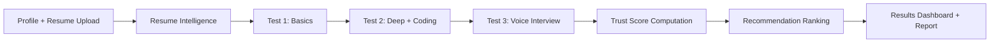
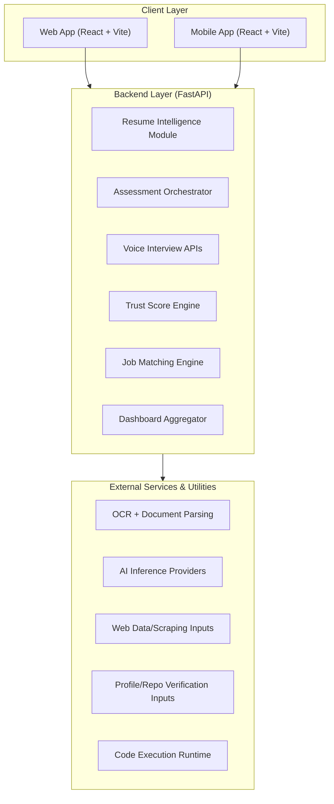

<div align="center">

# AI-Based Internship Recommendation Engine
### PM Internship Scheme | Trust-Score Driven Candidate Intelligence Platform

[](LICENSE)
[](https://python.org)
[](https://fastapi.tiangolo.com)
[](https://react.dev)
[](https://vitejs.dev)
[](#current-status)


<p>
  
</p>

**A full-stack platform that transforms internship shortlisting into a transparent, scalable, and candidate-friendly system through resume intelligence, multi-stage assessments, trust scoring, and explainable recommendations.**

</div>

---

## Table of Contents
- [Executive Summary](#executive-summary)
- [Problem Statement](#problem-statement)
- [Solution Overview](#solution-overview)
- [Key Capabilities](#key-capabilities)
- [End-to-End Candidate Journey](#end-to-end-candidate-journey)
- [Trust Score Methodology](#trust-score-methodology)
- [System Architecture](#system-architecture)
- [Data Flow](#data-flow)
- [Module Breakdown](#module-breakdown)
- [API Surface](#api-surface)
- [UI and UX Highlights](#ui-and-ux-highlights)
- [Project Structure](#project-structure)
- [Setup and Run](#setup-and-run)
- [Deployment Notes](#deployment-notes)
- [Evaluation and Outcomes](#evaluation-and-outcomes)
- [Demo Script for Professor](#demo-script-for-professor)
- [Current Status](#current-status)
- [Roadmap](#roadmap)
- [Contributing](#contributing)
- [License](#license)

---

## Executive Summary
This project is designed for internship ecosystems where application volume is high, candidate profiles are diverse, and fair evaluation is critical.  
Instead of relying on a single static score, the platform combines:
- profile understanding,
- stage-wise skill assessment,
- voice-based interview signals,
- and confidence-based recommendation logic.

It delivers an explainable final output: **who should be matched, why they were matched, and how reliable that match is.**

---

## Problem Statement
Traditional internship screening often struggles with:
- inconsistent resume quality,
- limited visibility into practical skill depth,
- difficulty comparing candidates fairly across backgrounds,
- weak explainability for final shortlist decisions.

For large-scale programs, this creates two risks:
- strong candidates can be missed,
- and weak matches can move forward.

---

## Solution Overview
The platform introduces a structured, three-layer evaluation pipeline:

1. **Resume Intelligence Layer**  
   Converts raw resumes into normalized candidate signals.

2. **Assessment + Interview Layer**  
   Evaluates conceptual knowledge, applied coding ability, and communication/confidence via a live voice interview.

3. **Trust + Matching Layer**  
   Produces a reliability-weighted trust score and maps candidates to the most suitable internship opportunities.

---

## Key Capabilities

### 1) Resume Intelligence
- Multi-format resume intake (text and scanned documents)
- OCR-supported extraction path
- Skill and profile signal identification
- Resume quality and readiness guidance

### 2) Three-Stage Assessment
- **Test 1:** Basics (core foundational check)
- **Test 2:** Deep + coding/problem solving
- **Test 3:** Agentic voice interview (dynamic questioning)
- Anti-cheating telemetry integrated into scoring logic

### 3) Voice Interview Workflow
- Interview session creation per candidate
- Candidate/domain-specific interview orchestration
- Transcript and evaluation capture
- Result retrieval and final report rendering

### 4) Trust Score Engine
- Multi-factor weighted scoring
- Stage-completion aware score capping
- Confidence and answer-quality considerations
- Explainability-first output for dashboards

### 5) Smart Recommendation Engine
- Skill-role relevance scoring
- Domain and context-aware ranking
- Final shortlist with confidence rationale

### 6) Candidate-Centric UX
- Guided onboarding
- Visual progress through all assessment stages
- Rich results dashboard
- Responsive web and mobile experiences

---

## End-to-End Candidate Journey


---

## Trust Score Methodology
The trust score is not a single quiz score; it is a composite reliability signal that considers:
- foundational understanding,
- applied technical depth,
- communication confidence,
- profile quality and consistency signals,
- integrity telemetry.

### Design Principles
- **Fairness:** avoids one-dimensional ranking
- **Explainability:** each stage contributes visible value
- **Robustness:** supports fallback paths and missing-signal handling
- **Scalability:** suitable for high candidate throughput

---

## System Architecture


---

## Data Flow
1. Candidate data is captured via onboarding UI.
2. Backend parsing modules normalize profile and resume signals.
3. Assessment services generate and evaluate stage outputs.
4. Voice interview session lifecycle stores transcript and evaluation artifacts.
5. Trust engine computes consolidated readiness score.
6. Matching engine ranks opportunities and returns explainable output.
7. Dashboard presents candidate-specific insights and recommendation results.

---

## Module Breakdown

### Backend Modules
- Candidate onboarding and parsing endpoints
- Assessment generation/execution and scoring
- Voice interview session routes + webhook handling
- Trust score calculation pipeline
- Match ranking and recommendation logic
- Reporting endpoints for result dashboards

### Frontend Modules
- Multi-step onboarding wizard
- Dynamic assessment interface (3 stages)
- Voice interview launch/status controls
- Results and recommendation dashboard
- Mobile-adapted candidate flow

---

## API Surface

### Voice Interview Endpoints
- `POST /api/interview/start`
- `POST /api/interview/webhook`
- `GET /api/interview/result/{candidate_id}`
- `GET /interview/result?id={candidate_id}`

### Assessment and Recommendation Endpoints
- Candidate profile + parsing routes
- Assessment generation and submission routes
- Trust score and final recommendation routes

---

## UI and UX Highlights
- Premium dark-themed modern interface
- Stage-wise visual progression for assessments
- Realtime status for voice interview lifecycle
- Report-style result experience for faculty/reviewer demonstrations
- Accessibility-oriented spacing, contrast, and responsiveness

---

## Project Structure
```text
.
├── main.py
├── interview_agent.py
├── interview_api.py
├── templates/
│   ├── interview.html
│   ├── result.html
│   └── error.html
├── frontend/
│   ├── src/
│   │   ├── components/
│   │   │   └── onboarding/
│   │   └── ...
│   └── ...
├── mobile-app/
├── requirements.txt
├── docker-compose.yml
└── README.md
```

---

## Setup and Run

### 1) Clone Repository
```bash
git clone https://github.com/SkTheAdvanceGamer/Al-Based-Internship-Recommendation-Engine-for-PM-Internship-Scheme.git
cd Al-Based-Internship-Recommendation-Engine-for-PM-Internship-Scheme
```

### 2) Backend
```bash
pip install -r requirements.txt
uvicorn main:app --reload
```

### 3) Frontend (Web)
```bash
cd frontend
npm install
npm run dev
```

### 4) Mobile Build (Optional)
```bash
cd mobile-app
npm install
npm run dev
```

---

## Deployment Notes
- Supports local and containerized workflows.
- Environment-driven config keeps deployment flexible.
- Secret files are intentionally excluded via `.gitignore`.
- Production hardening should include managed persistence for session artifacts.

---

## Evaluation and Outcomes
This project is suitable for academic and practical demos because it showcases:
- full-stack system design,
- AI-assisted data processing,
- real-time assessment orchestration,
- explainable recommendation logic,
- human-centered UX for evaluation transparency.

---

## Demo Script for Professor
Use this sequence during presentation:

1. Show onboarding and resume upload.
2. Run Test 1 basics.
3. Show Test 2 deep/coding section.
4. Launch Test 3 voice interview and show status updates.
5. Open the interview result/report view.
6. Submit final assessment and show generated trust score.
7. Present recommendation dashboard and explain ranking rationale.

This flow demonstrates product completeness from input to decision output.

---

## Current Status
- Three-stage assessment pipeline integrated.
- Voice interview workflow integrated with backend session handling.
- Result-report rendering live.
- Trust and recommendation pipeline active.
- Web and mobile experience both available.

---

## Roadmap
- Persistent data layer for interview sessions and longitudinal analytics
- Enhanced recommendation explainability panels
- Recruiter/admin review workspace
- Candidate progress tracking across repeated attempts
- Benchmarking dashboards for cohort-level insights

---

## Contributing
Contributions are welcome.  
For major changes, please open an issue first with:
- problem statement,
- proposed solution,
- impact on existing flow.

Then submit a focused PR with clear test notes.

---

## License
This project is licensed under the MIT License. See [LICENSE](LICENSE).

